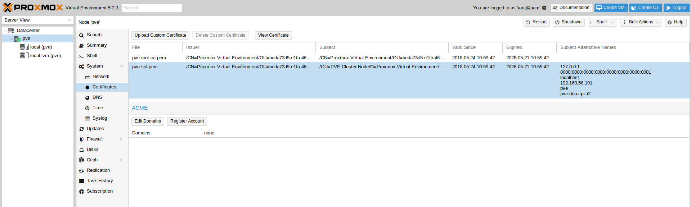
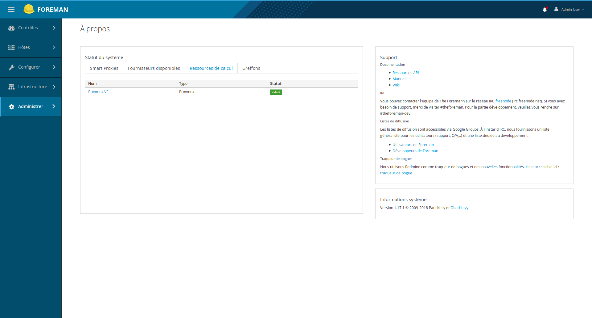
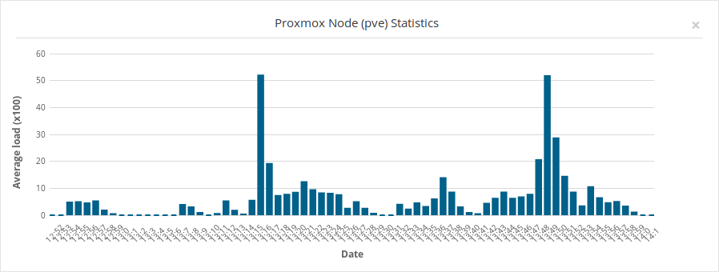
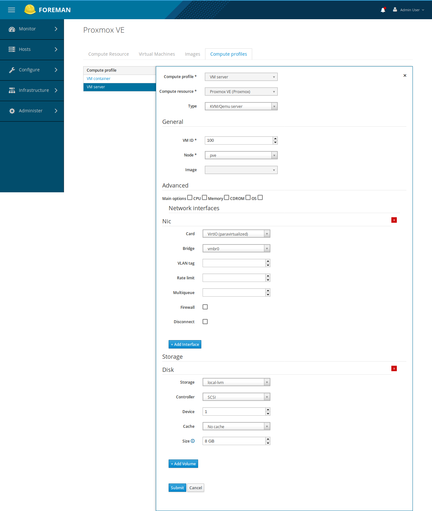
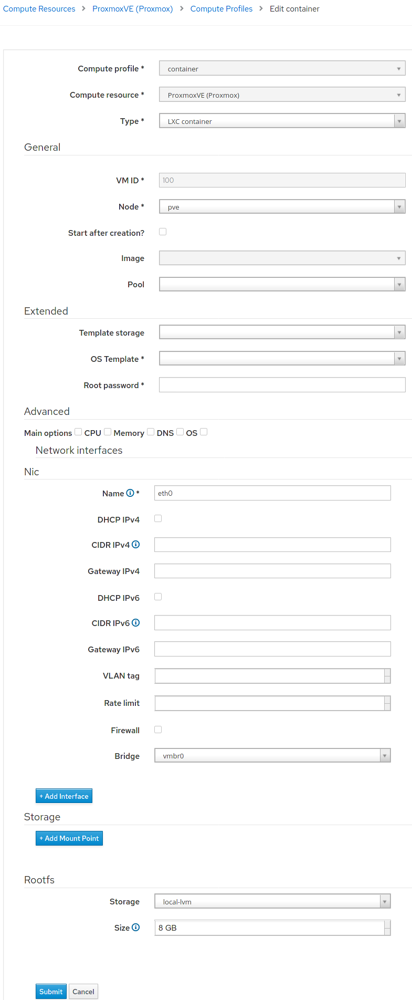
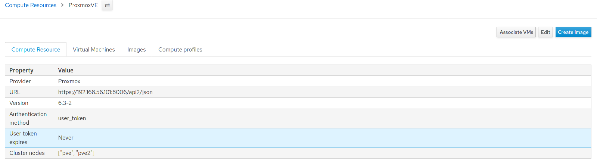
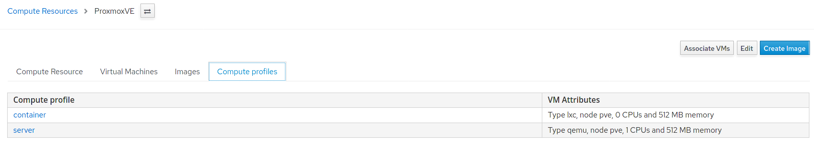
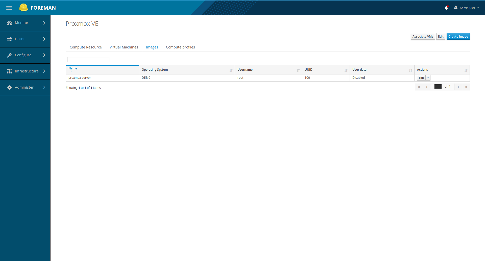

# Compute resource

## Create compute resource

You create a proxmox compute resource and set:

* the API REST URL, e.g: http://[host]:8006/api2/json
* username with sufficient privilegies to create vm within his realm, e.g: root@pam. Don't forget the @!

Then you can choose between two authentication modes:

Access ticket (Default):

* user password

Or user token:

* user token id with sufficient privilegies to create vm within his realm
* user token value

You can add SSL certificates too: check `SSL verify peer` and copy and paste the two cluster certificates: root and pve

Test if connection works, then save it.

Certificates can be copy and paste from your provider:

You can see vm associated with proxmox provider:

You can see it in about page:

You can see in welcome page this widget which shows node average load through time:

## Host group, profiles

To ease hosts management you can create a host group.

You can create profiles (server and container). Here is server sample:

Here is container sample:

You can show compute resource details:

Then you can list profiles:

## Associated vms

You can list VMs associated to your proxmox compute resource:

## Associated images

You can list images associated to your proxmox compute resource:

