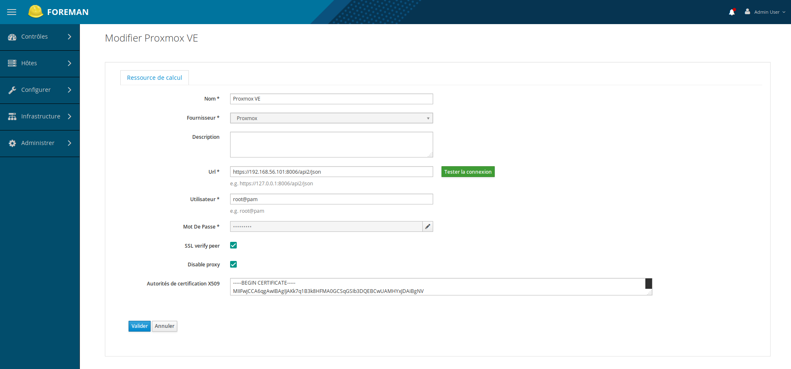
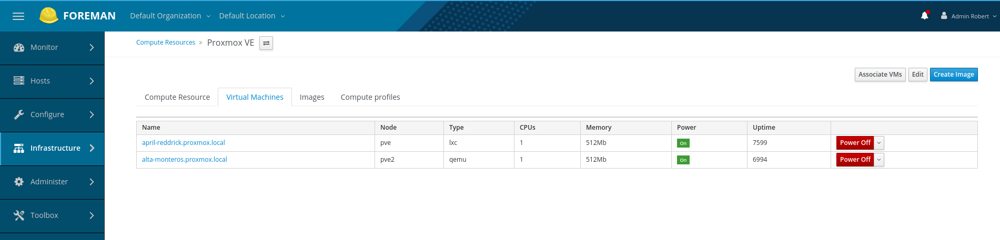
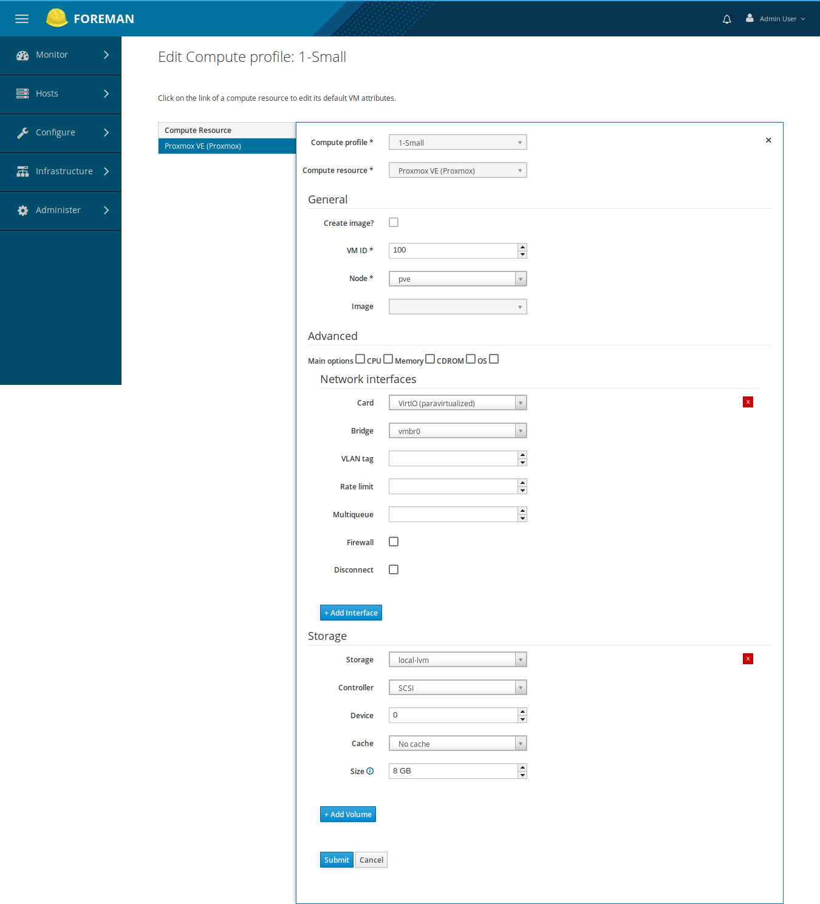

# Compute resource

## Create compute resource

You set:

* the API REST URL, e.g: http://[host]:8006/api2/json
* user with sufficient privilegies to create vm with his realm, e.g: root@pam. Don't forget the @!
* user password
* if ssl_verify_peer, copy and paste the two cluster certificates: root and pve

You can see vm associated with proxmox provider:

## Host group, profiles

To ease hosts management you can create a host group.

You can create profiles:

