# Manage hosts

## Create

VM Proxmox config tab:

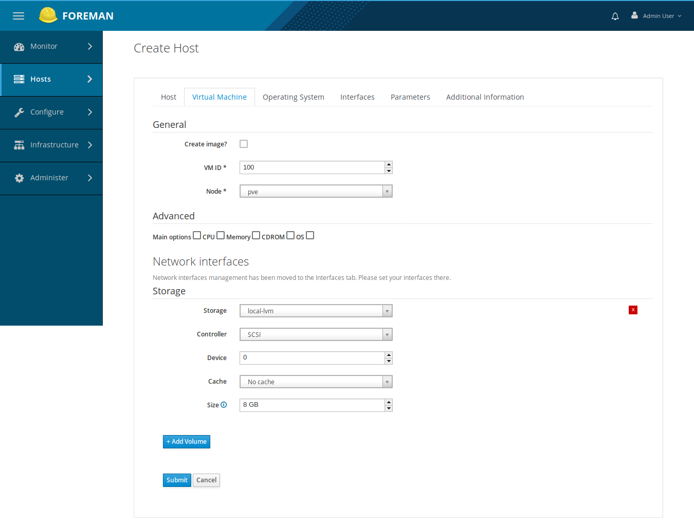

OS tab with build from network (default):

Network interface tab:

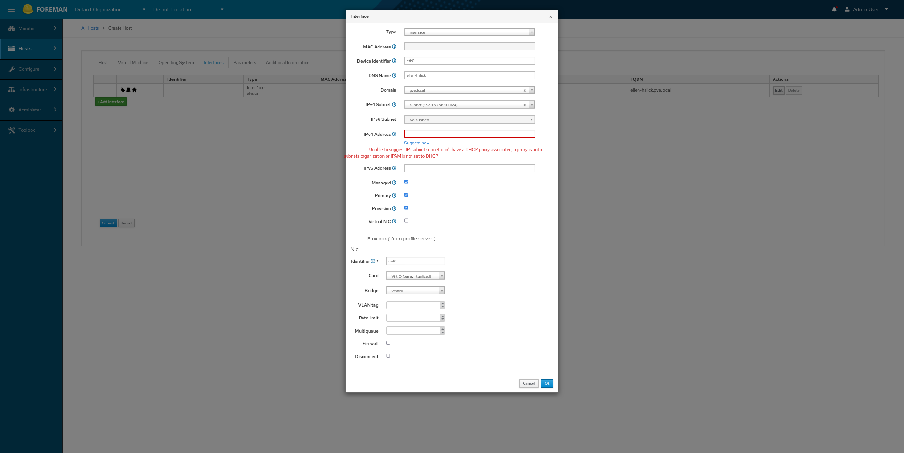

Identifier is required. You must set `net[n]` with n an integer.

## Update

Update config is available.

## Clone images

You can also change a host in an image, i.e. a [template](https://pve.proxmox.com/wiki/Qemu/KVM_Virtual_Machines#qm_templates) in Proxmox.
You update a host. You check the box `Create image?` to true and save it:

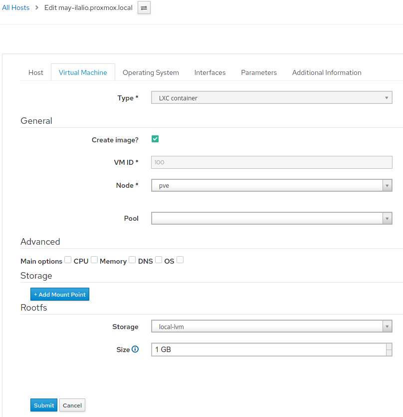

The image is then available in the list of the create image form.

You create an image from your compute ressource:

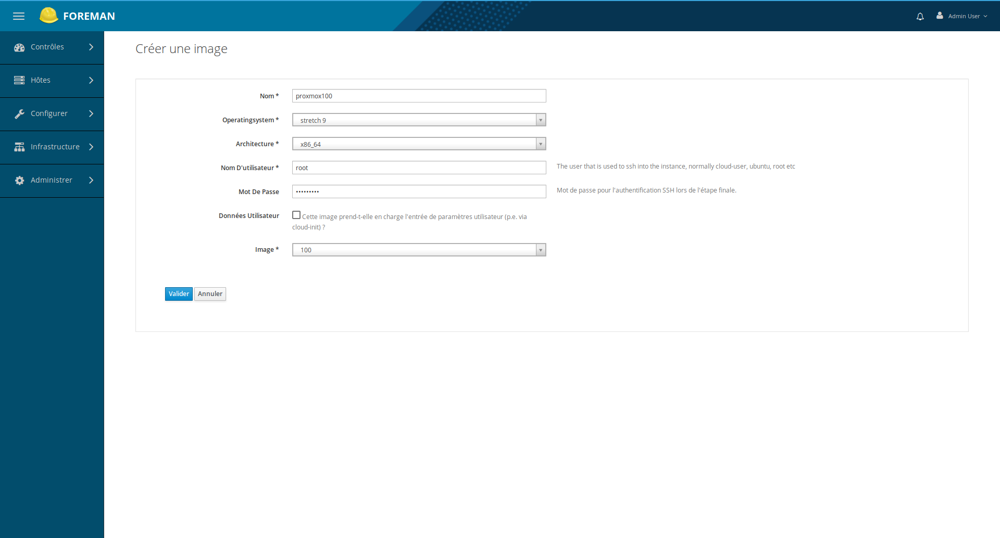

If previously you didn't created a template vm, the list of vmids is replaced by a single input:

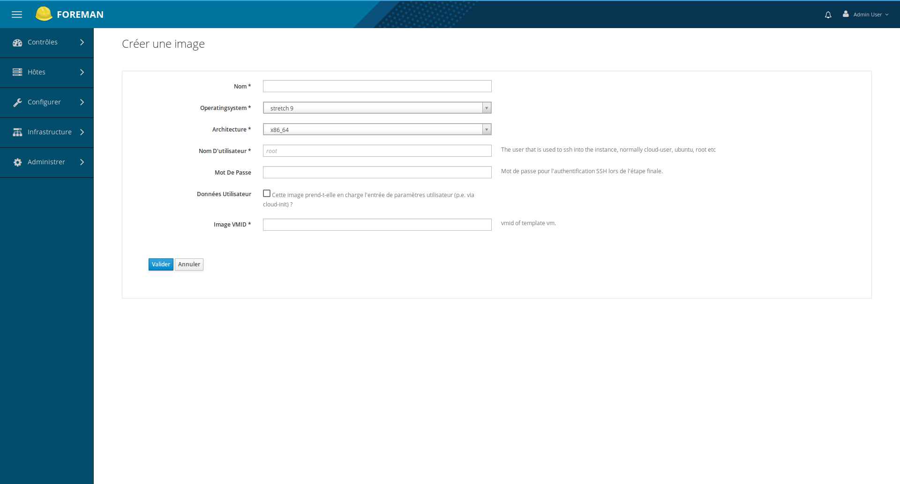

It is not recommended to create an image without a valid vmid template in proxmox.

Then you can make linked clones of this image. To do so, you create a new host and in OS tab you choose build from image and choose the available image:

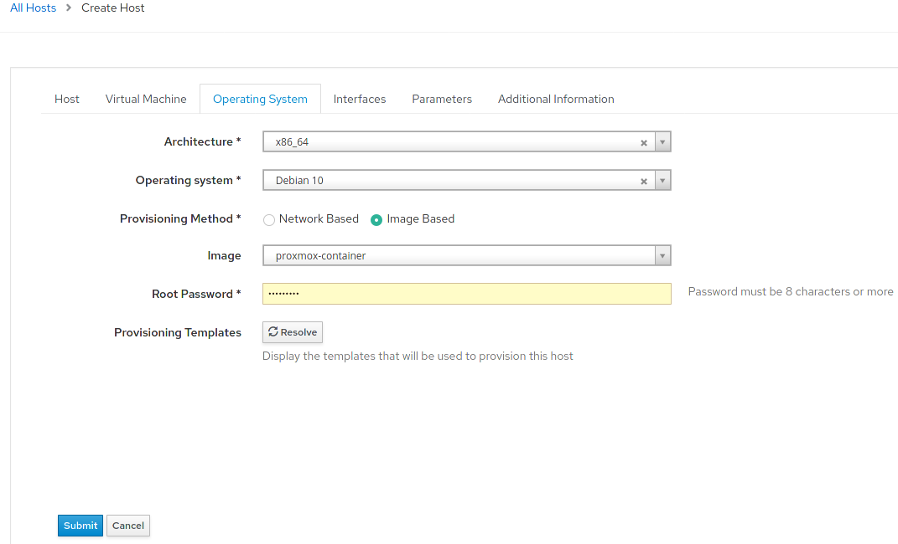

The the vm is cloned by proxmox in a new VM. The name starts with `Copy of image-name`.

## List hosts

You can list hosts in foreman:

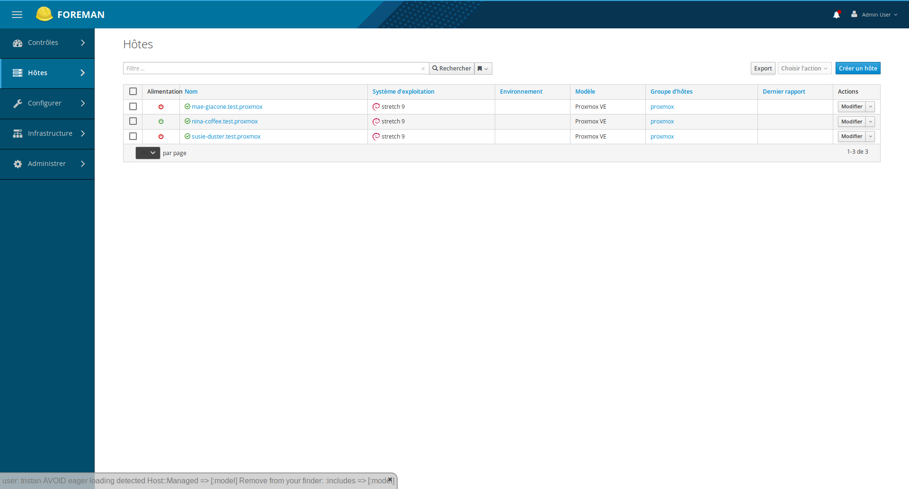

And you can check it in Proxmox wbe interface too:

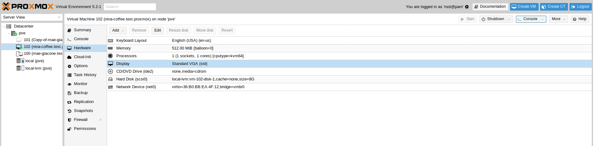

## Show a host

VM tab when vm is a template. `Templated?` is true:

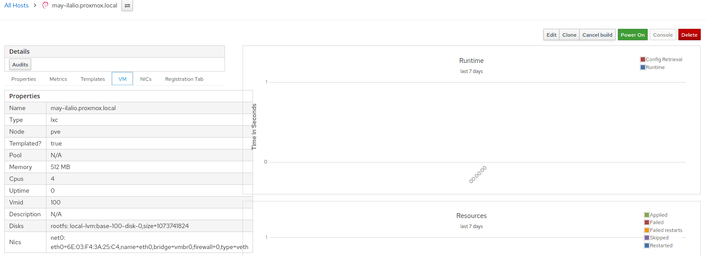

VM tab when vm is not a template. `Templated?` is false:

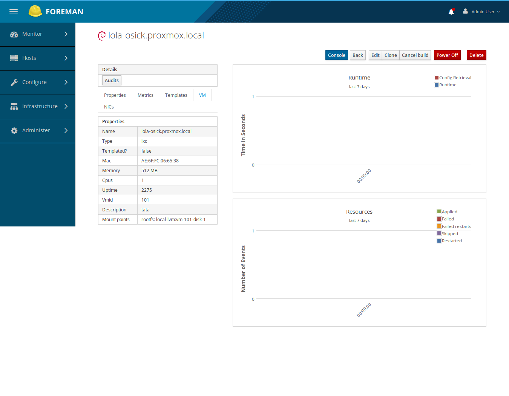

## Start, stop VM

You can start and stop a vm:

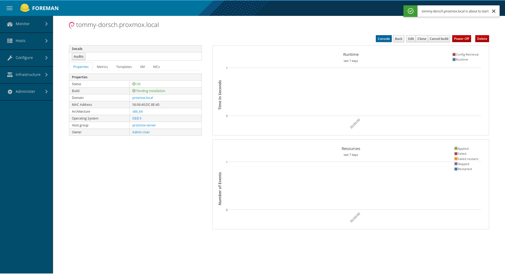

You can not run a template vm.

## Console

When vm is running, you can open a noVNC console on it:

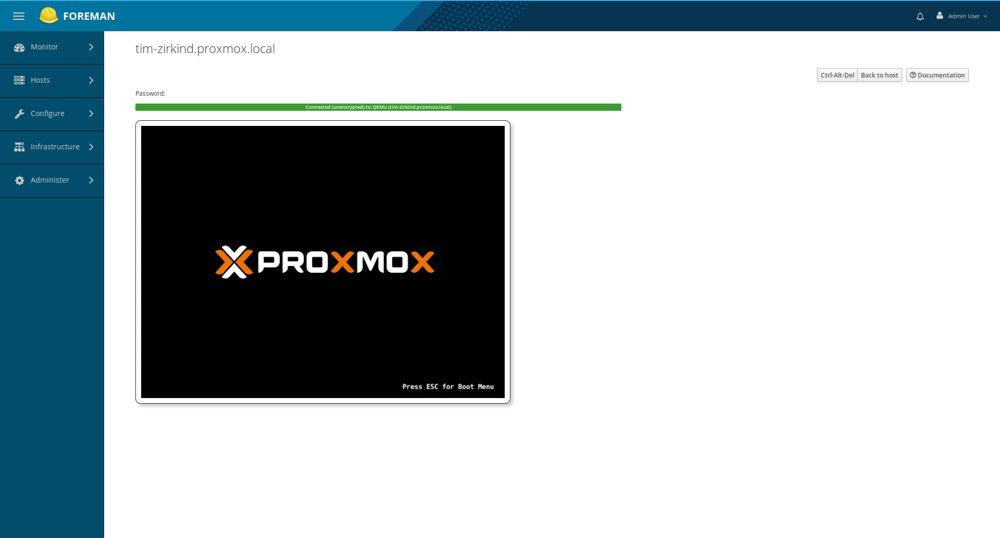

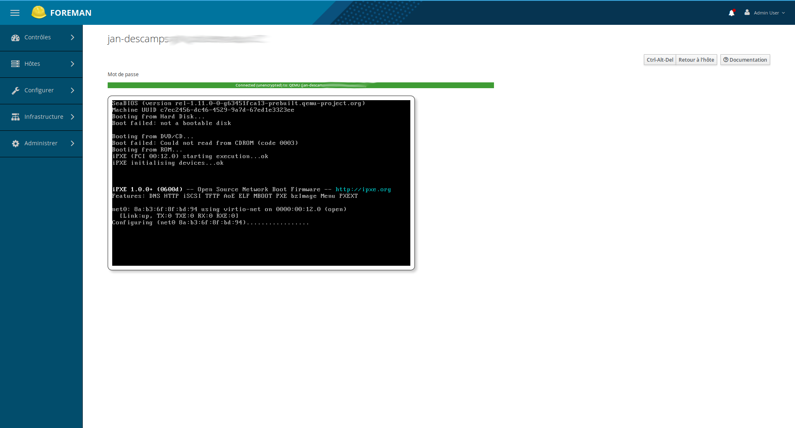