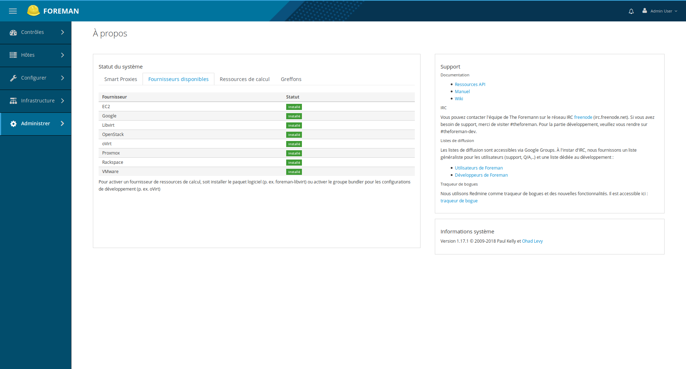
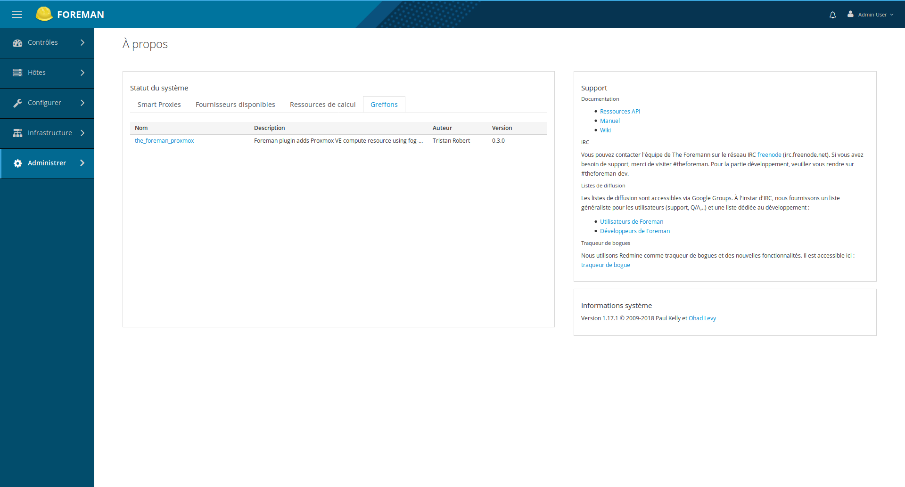

[](https://codeclimate.com/github/theforeman/foreman_fog_proxmox/maintainability)
[](https://codeclimate.com/github/theforeman/foreman_fog_proxmox/test_coverage)
[](https://badge.fury.io/rb/foreman_fog_proxmox)

# ForemanFogProxmox

[Foreman](http://theforeman.org/) plugin that adds [Proxmox](https://www.proxmox.com/en/proxmox-ve) compute resource: managing virtual machines and containers using the [fog-proxmox](https://github.com/fog/fog-proxmox) module.

It is intended to satisfy this [feature](http://projects.theforeman.org/issues/2186).

If you like it and need more features you can [contribute](.github/CONTRIBUTING.md) or simply [support](.github/SUPPORT.md) it:

## Support

You can support the plugin development via the following methods:

* [Donate by PayPal](https://paypal.me/TristanRobert)
* [Sponsor by Github](https://github.com/sponsors/tristanrobert)

## Compatibility versions

|Fog-proxmox|Proxmox|Foreman-fog-proxmox|Foreman|Ruby|
|--|--|--|--|--|
|<0.6|<5.3|<0.6|<=1.20|>=2.3|
|=0.6|<5.4|=0.6|=1.21|>=2.3|
|<=0.8 |<6.0|>=0.7|>=1.22|>=2.3|
|<0.9 |<6.0|=0.9|>=1.22|>=2.3|
|>=0.9 |>=5.4|>=0.9.1|>=1.22|>=2.3|
|>=0.10 |>=5.4|>=0.9.4|>=1.22|>=2.5|
|>=0.11 |>=5.4|>=0.10|>=1.22|>=2.5|
|>=0.12 |>=6.1|>=0.11|>=2.0|>=2.5|
|>=0.14 |>=6.2|>=0.13|>=2.4|>=2.5|

## Installation

### Prerequisites

You need [nodejs](https://nodejs.org/en/download/package-manager/) installed in order to use foreman-assets package.

### From gem

See complete details in [plugin installation from gem](https://theforeman.org/plugins/#2.3AdvancedInstallationfromGems)

Here is a Debian sample:

* Install foreman [from OS packages](https://theforeman.org/manuals/1.19/index.html#3.3InstallFromPackages):

```shell
sudo apt install -y foreman foreman-compute foreman-sqlite3 foreman-assets
```

* Use only foreman user (**not root!**) `sudo -u foreman ...`
* In /usr/share/foreman/bundler.d directory, add Gemfile.local.rb file and add this line in it:

```shell
echo "gem 'foreman_fog_proxmox'" | sudo -u foreman tee /usr/share/foreman/bundler.d/Gemfile.local.rb
```

* Install the gem plugin:

```shell
sudo -u foreman /usr/bin/foreman-ruby /usr/bin/bundle install
```

* Precompile plugin assets:

```shell
/usr/bin/foreman-ruby /usr/bin/bundle exec bin/rake plugin:assets:precompile[foreman_fog_proxmox]
```

* Compile plugin translations if (french) needed :

```shell
/usr/bin/foreman-ruby /usr/bin/bundle exec bin/rake plugin:gettext[foreman_fog_proxmox]
```

* Complete installation of foreman 1.22 with foreman-installer:

```shell
sudo apt install -y foreman-installer
sudo foreman-installer
```

If you don't want to have HTTP 503 errors when apt is trying to install puppetserver, then add this before launching foreman-installer:

```shell
echo 'Acquire::http::User-agent "Mozilla/5.0 (Linux)";' | sudo tee /etc/apt/apt.conf.d/96useragent
```

See complete details in [plugin installation from gem](https://theforeman.org/plugins/#2.3.2Debiandistributions)

Then you can check plugin installation after login into your new foreman server seeing the about foreman page:




### From OS packages

Please see the Foreman manual for complete instructions:

* [Foreman: How to Install a Plugin](http://theforeman.org/manuals/latest/index.html#6.1InstallaPlugin)

Redhat, CentOS or Fedora users should also [setup Selinux](https://projects.theforeman.org/projects/foreman/wiki/SELinux) to allow foreman and all its plugins to work.

## Usage

* [Compute resource](.github/compute_resource.md)
* [Manage hosts](.github/hosts.md)

## Development

### Prerequisites

* You need a Proxmox VE 5.4+ server running.
* You need ruby >= 2.5. You can install it with [asdf-vm](https://asdf-vm.com).
* You also need nodejs in your dev machine to run webpack-dev-server. You can install it with [asdf-vm](https://asdf-vm.com).

### Platform

* Fork this github repo.
* Clone it on your local machine
* Install foreman v1.22+ on your machine:

```shell
git clone https://github.com/theforeman/foreman -b develop
```

* Create a Gemfile.local.rb file in foreman/bundler.d/
* Add this line:

```ruby
gem 'foreman_fog_proxmox', :path => '../../theforeman/foreman_fog_proxmox'
gem 'fog-proxmox', :path => '../../fog/fog-proxmox' # optional if you need to modify fog-proxmox code too
gem 'ruby-debug-ide' # dev
gem 'debase' # dev
gem 'simplecov' # test
```

* In foreman directory, install dependencies:

```shell
gem install bundler
# prerequisites postgresql-client library on OS
bundle config set without 'libvirt ovirt mysql2'
bundle install
```

```shell
npm install
```

* Configure foreman settings:

```shell
cp config/settings.yaml.test config/settings.yaml
```

add these lines to config/settings.yml:

```yaml
    :webpack_dev_server: true
```

* SQLite is no more default rails dev or test database, instead add:

```shell
DATABASE_URL=nulldb://nohost
```

* (Optional) test and dev with postgresql database:

```shell
cp config/model.mappings.example config/model.mappings
cp config/database.yml.example config/database.yml
```

add these lines to config/database.yml:

```yaml
    username: foreman
    password: foreman
```

```shell
cp config/ignored_environments.yml.sample config/ignored_environments.yml
docker run --name foreman-db -e POSTGRES_DB=foreman -e POSTGRES_USER=foreman -e POSTGRES_PASSWORD=foreman -p 5432:5432 -d postgres
bundle exec bin/rake db:migrate
bundle exec bin/rake db:seed assets:precompile locale:pack webpack:compile
```

* You can reset admin password if needed:

```shell
bundle exec bin/rake permissions:reset
```

* You should write tests and you can execute those specific to this plugin:

first, create database `foreman-test` with psql commands:

```shell
docker exec -it foreman-db psql -U foreman
foreman=# create database "foreman-test";
```

all:

```shell
export DISABLE_SPRING=true
bundle exec bin/rake test:foreman_fog_proxmox
```

or just one:

```shell
export DISABLE_SPRING=true
bundle exec bin/rake test TEST=../foreman_fog_proxmox/test/functional/compute_resources_controller_test.rb DATABASE_URL=nulldb://nohost
```

* Check code syntax with rubocop and foreman rules:

```shell
bundle exec bin/rake foreman_fog_proxmox:rubocop
```

* See deface overrides result:

```shell
bundle exec bin/rake deface:get_result['hosts/_compute_detail']
```

* In foreman directory, after you modify foreman_fog_proxmox specific assets (proxmox.js, etc) you have to precompile it:

```shell
bundle exec bin/rake plugin:assets:precompile[foreman_fog_proxmox]
```

* In foreman directory, after you modify foreman_fog_proxmox translations (language, texts in new files, etc) you have to compile it:

```shell
bundle exec bin/rake plugin:gettext[foreman_fog_proxmox]
```

* In foreman directory, run in a new terminal the webpack-dev-server:

```shell
./node_modules/.bin/webpack-dev-server --config config/webpack.config.js
```

* Or without webpack-dev-server, add this line in config/settings.yml:

```yml
:webpack_dev_server: false
```

then compile webpack assets:

```shell
bundle exec bin/rake webpack:compile
```

* In foreman directory, run rails server:

```shell
bundle exec bin/rails server
```

* Or you can launch all together:

```shell
bundle exec foreman start
```

See details in [foreman plugin development](https://projects.theforeman.org/projects/foreman/wiki/How_to_Create_a_Plugin)

## Contributing

If you like it and still want to improve it, [sponsor me](https://github.com/sponsors/tristanrobert)!

* You can reach the [contributors](.github/CONTRIBUTORS.md).
* [Translate it in your favorite language](https://www.transifex.com/foreman/foreman/foreman_fog_proxmox/)
* Bug reports and pull requests are welcome on GitHub at [ForemanFogProxmox](https://github.com/theforeman/foreman_fog_proxmox).

Please read more information about [how to contribute](.github/CONTRIBUTING.md).

## License

The code is available as open source under the terms of the [GNU Public License v3](LICENSE).
